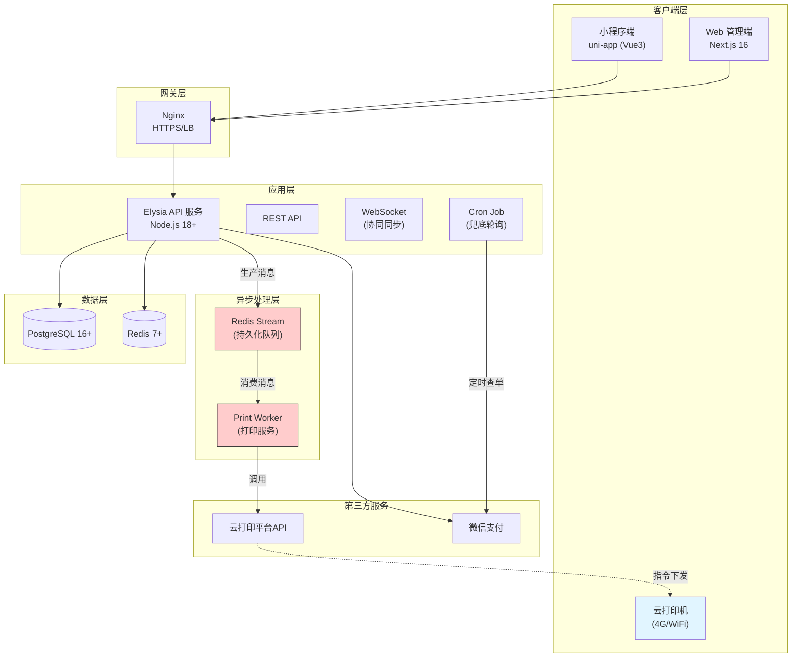
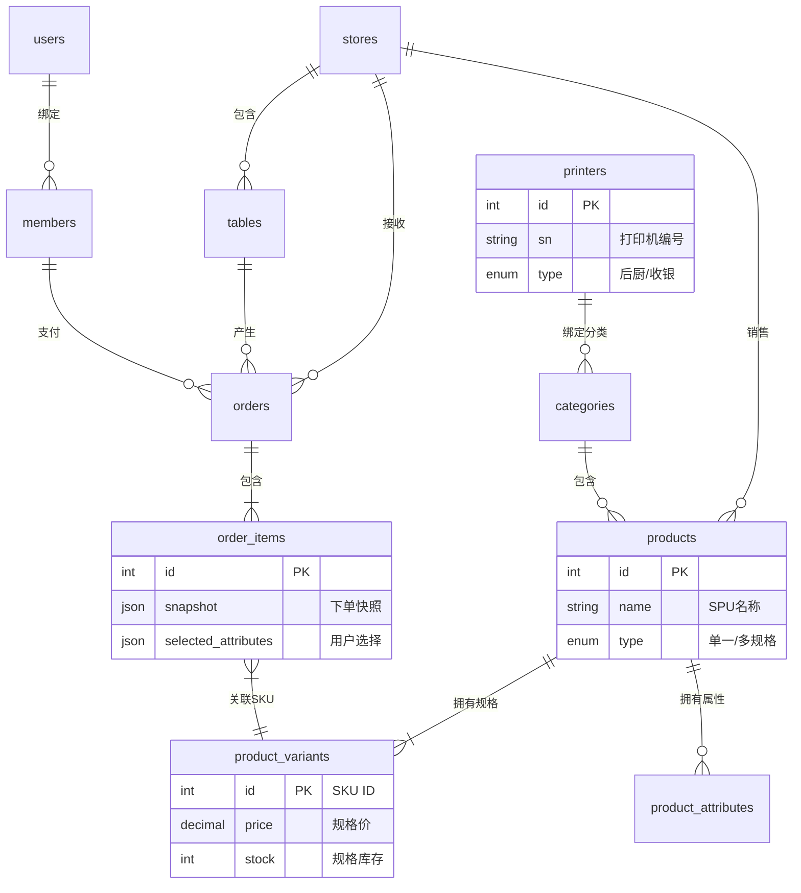
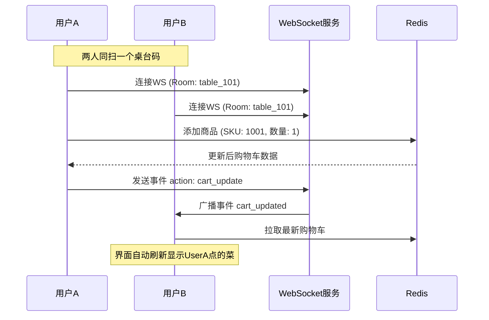
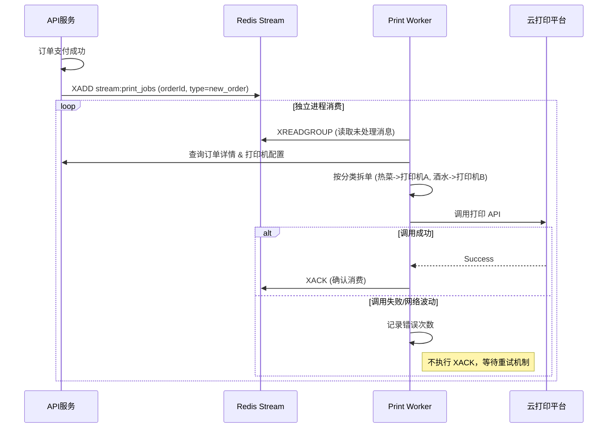

# 桌台扫码点单系统架构设计文档 (Final)

## 一、系统概述

### 1.1 系统定位
构建一套支持**多人协同点单**、**后厨自动化分单打印**的完整餐饮应用体系，涵盖商家后台管理、顾客小程序点单、后端服务及硬件交互层。系统旨在通过数字化手段提升餐饮门店的运营效率和顾客体验。

### 1.2 核心价值
- **顾客端**：
    - **多人协同**：支持多人同时扫码进入同一桌台，实时共享购物车状态，适合聚餐场景。
    - **复杂选配**：支持多规格（SKU）及自定义属性（如甜度、做法）选择。
    - **实时进度**：实时查看订单制作及上菜进度。
- **商家端**：
    - **自动化接单**：订单支付后自动分单打印至后厨、吧台等不同档口。
    - **精细管理**：支持商品 SKU 管理、库存预警、防跑单风控。
    - **数据决策**：提供营收统计、商品销售分析等报表。
- **系统端**：
    - **高可靠性**：基于 Redis Stream 的消息队列设计，保证打印任务和订单通知不丢失。
    - **弱网容错**：支持离线菜单浏览和乐观 UI 更新。

### 1.3 技术选型

| 层级 | 技术栈 | 说明 |
| :--- | :--- | :--- |
| **Web 管理端** | Next.js 16 (App Router) | Server Components, Server Actions, Edge Runtime |
| **小程序端** | uni-app (Vue3 + script setup) | 跨端框架，本期聚焦微信小程序，支持 GPS 获取 |
| **后端服务** | Elysia + Node 18+ | 高性能 API 网关，支持 WebSocket |
| **消息队列** | **Redis Stream** | **[v2.0]** 替代 Pub/Sub，用于打印任务、订单通知的持久化队列 |
| **打印服务** | **Node.js Worker** | **[v2.0]** 独立进程消费队列，对接云打印机（飞鹅/易联云） |
| **ORM** | Drizzle | 类型安全，Schema 增加 SKU 与打印机定义 |
| **数据库** | PostgreSQL 16+ | 业务数据主存储 |
| **缓存/协同** | Redis 7+ | 共享购物车、分布式锁、会话管理 |
| **部署** | Docker Compose | 统一容器化部署 |

---

## 二、系统架构

### 2.1 整体架构图



### 2.2 小程序端架构设计
**技术栈**：uni-app (Vue3 + script setup) + uni-ui
**核心功能**：
- **协同点单**：通过 WebSocket 连接 `table_room`，实时接收购物车变更事件 `cart_updated`，实现多人同步。
- **本地缓存**：使用 `uni.setStorage` 缓存菜单数据，支持弱网环境下浏览。
- **GPS 风控**：调用 `uni.getLocation` 获取经纬度，下单时校验距离。
- **乐观 UI**：操作购物车时先更新界面，后台异步同步，失败则回滚。

### 2.3 管理端架构设计
**技术栈**：Next.js 16 (App Router) + TailwindCSS
**核心架构**：
- **Server Components**：默认使用服务端组件渲染，减少客户端 Bundle 体积。
- **Server Actions**：直接在组件内调用后端 API，简化数据获取逻辑。
- **Edge Runtime**：部分轻量级页面（如状态看板）部署在 Edge 节点，提升访问速度。
- **权限控制**：基于 RBAC 模型，区分超管、店长、店员权限。

### 2.4 后端架构设计
**技术栈**：Elysia (Node.js) + Drizzle + Redis
**核心模块**：
- **API 网关**：统一处理鉴权、限流、参数校验。
- **消息队列 (Redis Stream)**：
    - `stream:print_jobs`：打印任务队列，支持 ACK 确认机制，防止丢单。
    - `stream:order_events`：订单状态变更事件，用于触发积分、通知等异步操作。
- **打印 Worker**：独立 Node.js 进程，消费 Redis Stream，对接云打印机 API，支持失败重试与死信队列。
- **WebSocket 服务**：维护桌台连接池，广播购物车状态。

### 2.5 核心模块划分

| 模块 | 职责 | 关键特性 (v2.0) |
| :--- | :--- | :--- |
| **硬件打印模块** | 打印机管理、模板渲染、分单逻辑 | 支持后厨/吧台/传菜分单，断网重试 |
| **协同购物车模块** | 多人通过 WebSocket 同步购物车状态 | 基于 `cart:{storeId}:{tableId}` 的共享存储 |
| **商品管理模块** | SPU/SKU 管理、属性（加料/口味）管理 | 支持多规格（大/中/小）与多属性（微辣/中辣） |
| **订单管理模块** | 状态机、快照存储、支付回调 | 增加商品快照，防止改价影响历史订单 |
| **风控模块** | 距离校验、恶意下单拦截 | GPS 围栏（距离 > 1km 禁止下单） |
| **会员积分模块** | 会员等级、积分累计/消费 | 消费自动积分，积分抵扣 |

---

## 三、数据模型设计

### 3.1 核心实体关系 ER 图



### 3.2 详细数据表设计

#### 1. 门店与桌台 (Stores & Tables)
| 表名 | 字段 | 类型 | 说明 |
| :--- | :--- | :--- | :--- |
| **stores** | id | Int | 门店 ID |
| | name | String | 门店名称 |
| | status | Enum | active/closed |
| **tables** | id | Int | 桌台 ID |
| | store_id | Int | 所属门店 |
| | name | String | 桌台号（如 A01） |
| | qr_code | String | 二维码 Token |
| | status | Enum | free/occupied |

#### 2. 商品体系 (Products & Variants)
| 表名 | 字段 | 类型 | 说明 |
| :--- | :--- | :--- | :--- |
| **categories** | id | Int | 分类 ID |
| | name | String | 分类名（如热菜、酒水） |
| **products** | id | Int | 商品 ID (SPU) |
| | category_id | Int | 所属分类 |
| | name | String | 商品名称 |
| | type | Enum | **[v2.0]** `single`(单品)/`variant`(多规格) |
| | image_url | String | 商品图片 |
| | status | Enum | available/soldout |
| **product_variants** | id | Int | **[v2.0]** SKU ID |
| | product_id | Int | 关联主商品 |
| | specs | Json | 规格组合 `{"size": "大", "temp": "冰"}` |
| | price | Decimal | 该规格价格 |
| | stock | Int | 该规格库存 |
| **product_attributes**| id | Int | **[v2.0]** 属性 ID |
| | product_id | Int | 关联商品 |
| | name | String | 属性名（如做法） |
| | options | Json | 选项列表 `["微辣", "中辣"]` |

#### 3. 打印机体系 (Printers) **[v2.0 新增]**
| 表名 | 字段 | 类型 | 说明 |
| :--- | :--- | :--- | :--- |
| **printers** | id | Int | 主键 |
| | sn | String | 打印机 SN 码 |
| | key | String | 打印机密钥 |
| | name | String | 备注（如：凉菜房打印机） |
| | type | Enum | `kitchen`(后厨), `cashier`(收银) |
| **category_printers**| category_id | Int | 分类 ID |
| | printer_id | Int | 打印机 ID |
| | | | *逻辑：分类绑定打印机，实现自动分单* |

#### 4. 订单体系 (Orders)
| 表名 | 字段 | 类型 | 说明 |
| :--- | :--- | :--- | :--- |
| **orders** | id | Int | 订单 ID |
| | order_no | String | 业务订单号（唯一） |
| | table_id | Int | 桌台 ID |
| | total_amount | Decimal | 订单总金额 |
| | status | Enum | pending/paid/completed/cancelled |
| | created_at | DateTime | 下单时间 |
| **order_items** | id | Int | 订单项 ID |
| | order_id | Int | 关联订单 |
| | product_variant_id| Int | 关联 SKU |
| | quantity | Int | 数量 |
| | **snapshot** | Json | **[v2.0]** 下单快照（名称/单价/分类），防止改价影响 |
| | attributes | Json | **[v2.0]** 选中的属性 `[{"name":"辣度","value":"微辣"}]` |

#### 5. 用户与会员 (Users & Members)
| 表名 | 字段 | 类型 | 说明 |
| :--- | :--- | :--- | :--- |
| **users** | id | Int | 用户 ID |
| | openid | String | 微信 OpenID |
| | nickname | String | 昵称 |
| **members** | id | Int | 会员 ID |
| | user_id | Int | 关联用户 |
| | level | Int | 会员等级 |
| | points | Int | 当前积分 |

---

## 四、核心业务流程

### 4.1 多人协同购物车流程
解决“一桌多人扫码，能不能看到别人点了什么”的问题。

**策略**：
1. **Key 设计**：使用 `cart:{storeId}:{tableId}` 作为唯一 Key。
2. **并发控制**：Redis 原子操作或乐观锁。
3. **实时通知**：WebSocket 广播。



### 4.2 异步可靠打印流程
解决“打印机没纸、断网、接口超时”导致丢单的问题。

**组件**：Redis Stream (Key: `stream:print_jobs`)



### 4.3 GPS 围栏与风控
**逻辑**：
1. 小程序端 `uni.getLocation` 获取经纬度。
2. 扫码接口 `/api/qr/{token}` 增加 `lat`, `lng` 参数。
3. 后端计算距离（Haversine 公式）。
4. **规则**：距离 > 1km 且非外卖模式 -> 拒绝开台/下单。

---

## 五、API 接口设计

### 5.1 购物车 API (协同版)
| 接口 | 方法 | 路径 | 说明 |
| :--- | :--- | :--- | :--- |
| **同步购物车** | POST | `/api/cart/sync` | **[v2.0]** 替代简单的 add/remove。提交本地操作 Diff，返回最新全量购物车。 |
| **清空购物车** | DELETE | `/api/cart` | 清空当前桌台购物车 |

### 5.2 打印机管理 (Admin)
| 接口 | 方法 | 路径 | 说明 |
| :--- | :--- | :--- | :--- |
| **添加打印机** | POST | `/api/admin/printers` | 录入 SN、Key |
| **测试打印** | POST | `/api/admin/printers/:id/test` | 发送测试页 |
| **关联分类** | POST | `/api/admin/printers/bind` | 绑定分类与打印机 |

---

## 六、可靠性与容错设计

### 6.1 支付兜底机制
- **问题**：用户支付成功但微信回调丢失。
- **方案**：
    - **主动轮询 (Cron Job)**：每 1 分钟扫描 `orders` 表中状态为 `pending` 且 `created_at` 在 15 分钟内的订单。
    - **动作**：调用微信支付 `查询订单API`。
    - **结果**：如果微信返回 `SUCCESS`，则手动触发“支付成功”业务逻辑。

### 6.2 打印容错
- **Redis Stream Consumer Group**：实现 `PEL` (Pending Entries List) 机制。消费者重启后可重新读取未 ACK 的消息。
- **死信队列**：重试 5 次仍失败的任务移入死信队列，并发送报警通知。

### 6.3 弱网体验优化
- **本地缓存**：小程序端缓存菜单数据（Local Storage），断网时仍可浏览。
- **乐观 UI**：操作先展示成功动画，后台静默同步。同步失败则回滚并提示。

---

## 七、部署与运维

### 7.1 部署架构 (Docker Compose)
```yaml
version: '3.8'
services:
  nginx:
    image: nginx:alpine
    ports: ["80:80", "443:443"]
  
  api:
    build: ./api
    environment:
      - DATABASE_URL=postgres://...
      - REDIS_URL=redis://...
  
  web:
    build: ./web
    ports: ["3000:3000"]

  # [v2.0 新增] 打印与异步任务 Worker
  job-worker:
    build: 
      context: ./api
      dockerfile: Dockerfile.worker
    command: node dist/worker.js
    restart: always
    depends_on:
      - redis
      - postgres

  postgres:
    image: postgres:16
  
  redis:
    image: redis:7.0
```

### 7.2 监控指标
| 指标 | 目标值 | 说明 |
| :--- | :--- | :--- |
| **API 响应时间** | < 500ms | 常规接口 P95 |
| **订单创建耗时** | < 1s | 包含库存扣减 |
| **打印失败率** | < 0.1% | 需重点监控 |
| **支付回调丢失数** | 0 | 需立即报警 |

### 7.3 业务约束
| 约束 | 说明 |
| :--- | :--- |
| **单笔订单上限** | 最多 50 个商品项，防止恶意攻击 |
| **购物车有效期** | 2 小时未操作自动清空 |
| **订单支付超时** | 15 分钟未支付自动取消 |
| **优惠券限制** | 每笔订单最多使用 1 张 |
| **库存预警** | 库存低于 10 时触发预警 |

---

## 八、未来优化方向

### 8.1 技术层面
- **读写分离**：随着订单量增长，引入 PostgreSQL 主从复制。
- **全文搜索**：引入 Elasticsearch 支持复杂的菜品搜索。
- **服务网格**：微服务化后引入 Istio 进行流量治理。

### 8.2 业务层面
- **AI 智能推荐**：基于历史订单数据，为顾客推荐可能喜欢的菜品。
- **语音点单**：小程序接入语音识别，辅助老年人点单。
- **外卖对接**：打通美团/饿了么接口，实现全渠道订单统一管理。

---

## 九、总结
本架构文档整合了 v2.0 的所有高级特性（协同点单、SKU、云打印、Redis Stream）以及完整的数据模型设计。系统具备了商业级餐饮软件的完整能力，能够支撑从点单、制作、分单到对账的全生命周期管理。
