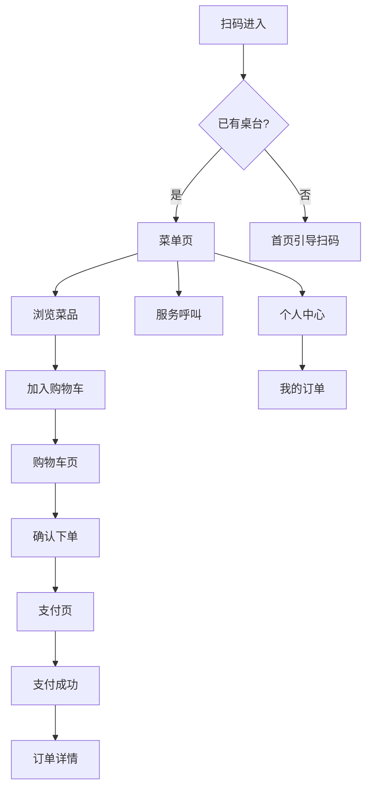
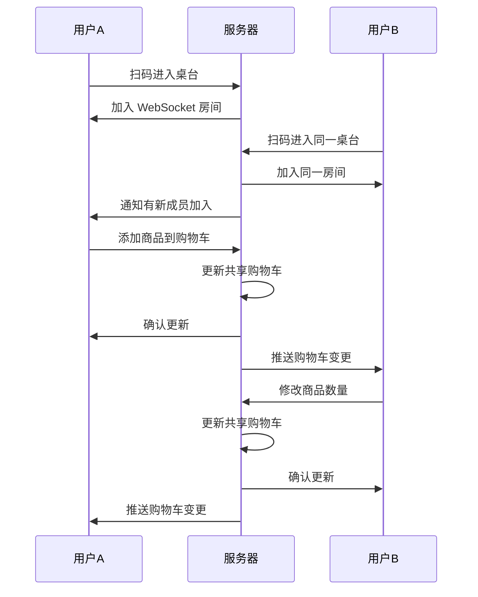

# 桌台扫码点单小程序 - 功能规划文档

> 更新时间: 2024-12-03
> 设计规范: 750rpx 设计稿

## 一、产品概述

### 1.1 产品定位
面向餐饮门店顾客的微信小程序，支持**扫码点单**、**多人协同**、**在线支付**，提供现代化、流畅的点餐体验。

### 1.2 核心特性
- 🍽️ **扫码即用**：无需下载，扫描桌台二维码即可点餐
- 👥 **多人协同**：同桌顾客实时共享购物车，适合聚餐场景
- ⚡ **极速体验**：骨架屏 + 乐观更新，操作响应 < 100ms
- 🎨 **现代 UI**：简约设计，大图展示，沉浸式体验
- 🔔 **实时同步**：WebSocket 实时推送订单状态

### 1.3 技术选型

| 层级 | 技术 | 说明 |
|:---|:---|:---|
| 框架 | uni-app (Vue3 + script setup) | 跨端开发，主攻微信小程序 |
| UI 库 | uni-ui + 自定义组件 | 保证一致的设计语言 |
| 状态管理 | Pinia | Vue3 官方推荐 |
| 请求库 | uni.request 封装 | 统一错误处理 |
| 实时通信 | WebSocket | 协同点单同步 |
| 设计单位 | rpx | 750rpx = 屏幕宽度 |

### 1.4 设计规范基础

```
设计稿宽度: 750rpx (对应 375px 设计稿 × 2)
屏幕适配: 自动按比例缩放
1rpx ≈ 0.5px (在 375px 宽度设备上)
```

---

## 二、页面架构

### 2.1 页面结构

```
pages/
├── index/                    # 首页（扫码入口）
│   └── index.vue
├── scan/                     # 扫码结果页
│   └── index.vue
├── menu/                     # 菜单页（核心）
│   └── index.vue
├── cart/                     # 购物车页
│   └── index.vue
├── order/                    # 下单确认页
│   └── index.vue
├── pay/                      # 支付页
│   └── index.vue
├── order-detail/             # 订单详情
│   └── index.vue
├── order-list/               # 我的订单
│   └── index.vue
├── product-detail/           # 商品详情
│   └── index.vue
├── service/                  # 服务呼叫
│   └── index.vue
└── user/                     # 个人中心
    └── index.vue
```

### 2.2 页面流程



---

## 三、核心功能模块

### 3.1 首页 / 扫码入口

**功能描述**：
- 引导用户扫描桌台二维码
- 展示门店 Logo 和欢迎语
- 支持手动输入桌台号（备用）

**布局规范 (rpx)**：

```
┌────────────────────────────────────────────────────────────┐
│                        状态栏 (系统)                        │
├────────────────────────────────────────────────────────────┤
│                                                             │
│                     [ 门店 Logo ]                           │  160rpx × 160rpx
│                      圆角: 24rpx                            │
│                                                             │
│                    欢迎光临 XX 餐厅                          │  字号: 40rpx, 加粗
│                   扫码开始点餐吧~                            │  字号: 28rpx, #666
│                                                             │
│                                                             │  间距: 120rpx
│                ┌─────────────────────┐                      │
│                │                     │                      │
│                │    [ 扫码动画 ]     │                      │  400rpx × 400rpx
│                │    Lottie 动画      │                      │
│                │                     │                      │
│                └─────────────────────┘                      │
│                                                             │
│               ┌─────────────────────────┐                   │
│               │       扫码点餐          │                   │  宽度: 400rpx
│               └─────────────────────────┘                   │  高度: 96rpx
│                                                             │
│                    手动输入桌台号 >                          │  字号: 28rpx, #999
│                                                             │
└────────────────────────────────────────────────────────────┘
  页面背景: 渐变 #FFF8F5 → #FFFFFF
```

**样式代码**：

```scss
.page-index {
  min-height: 100vh;
  background: linear-gradient(180deg, $primary-lighter 0%, $bg-card 50%);
  display: flex;
  flex-direction: column;
  align-items: center;
  padding-top: 160rpx;
  
  &__logo {
    width: 160rpx;
    height: 160rpx;
    border-radius: 24rpx;
    box-shadow: $shadow-base;
  }
  
  &__title {
    margin-top: 40rpx;
    font-size: 40rpx;
    font-weight: $font-weight-semibold;
    color: $text-primary;
  }
  
  &__subtitle {
    margin-top: 12rpx;
    font-size: 28rpx;
    color: $text-secondary;
  }
  
  &__scan-area {
    margin-top: 120rpx;
    width: 400rpx;
    height: 400rpx;
  }
  
  &__scan-btn {
    margin-top: 60rpx;
    width: 400rpx;
    height: 96rpx;
  }
  
  &__manual-entry {
    margin-top: 40rpx;
    font-size: 28rpx;
    color: $text-tertiary;
  }
}
```

### 3.2 菜单页（核心）

**功能描述**：
- 左侧分类导航，右侧商品列表
- 商品卡片大图展示，突出菜品照片
- 加购动画（贝塞尔曲线飞入购物车）
- 底部悬浮购物车栏
- 支持搜索商品
- 分类吸顶效果

**布局规范 (rpx)**：

```
┌──────────────────────────────────────────────────────────────┐
│  状态栏 (系统高度)                                            │
├──────────────────────────────────────────────────────────────┤
│  ┌────────────────────────────────────────┐  ┌──────────┐    │
│  │ 🔍  搜索菜品                           │  │  A01桌   │    │  搜索栏高度: 72rpx
│  └────────────────────────────────────────┘  └──────────┘    │  左右边距: 24rpx
├───────┬──────────────────────────────────────────────────────┤
│       │                                                       │
│ 招牌菜 │   ┌─────────────────────────────────────────────────┐│
│       │   │                                                 ││
│───────│   │  ┌────────┐   商品名称              ¥38.00     ││  商品卡片
│       │   │  │        │   描述信息一行省略...              ││  高度: 260rpx
│ 凉 菜 │   │  │ 220rpx │                                    ││  图片: 220×220rpx
│       │   │  │  图片  │   🏷️招牌  �热销                   ││
│───────│   │  │        │                                    ││
│       │   │  └────────┘   月售128         [ - ] 1 [ + ]   ││
│ 热 菜 │   │                                                 ││
│       │   └─────────────────────────────────────────────────┘│
│───────│                                                       │  商品卡片间距: 20rpx
│       │   ┌─────────────────────────────────────────────────┐│
│ 主 食 │   │                                                 ││
│       │   │  [ 下一个商品卡片 ]                             ││
│───────│   │                                                 ││
│       │   └─────────────────────────────────────────────────┘│
│ 饮 料 │                                                       │
│       │                                                       │
├───────┴──────────────────────────────────────────────────────┤
│  ┌────┐                                                       │
│  │ 🛒 │  已选 3 件        ¥128.00            [ 去结算 ]      │  购物车栏: 100rpx
│  │(3) │                                                       │  + 安全区域
│  └────┘                                                       │
└──────────────────────────────────────────────────────────────┘
  分类栏宽度: 160rpx
  商品区宽度: 750 - 160 = 590rpx
```

**详细尺寸**：

| 元素 | 尺寸 |
|:---|:---|
| 搜索栏高度 | 72rpx |
| 搜索栏圆角 | 36rpx |
| 分类栏宽度 | 160rpx |
| 分类项高度 | 100rpx |
| 分类选中指示条 | 6rpx × 40rpx |
| 商品卡片内边距 | 24rpx |
| 商品图片尺寸 | 220rpx × 220rpx |
| 商品图片圆角 | 16rpx |
| 商品卡片间距 | 20rpx |
| 购物车栏高度 | 100rpx |
| 购物车图标区 | 100rpx × 100rpx |
| 结算按钮宽度 | 200rpx |
| 结算按钮高度 | 80rpx |

**交互细节**：
- 点击分类平滑滚动到对应位置（动画 300ms）
- 滚动商品列表时分类自动高亮
- 加购时商品图片飞入购物车图标（贝塞尔曲线动画 500ms）
- 购物车有商品时显示红点数量（最大显示 99+）
- 下拉刷新、上拉加载更多

### 3.3 商品详情页（半屏弹窗）

**功能描述**：
- 商品大图展示
- 详细描述和配料信息
- SKU 规格选择（大/中/小）
- 自定义属性选择（辣度、甜度等）
- 备注输入
- 加入购物车

**布局规范 (rpx)**：

```
┌──────────────────────────────────────────────────────────────┐
│                                                              │
│                       [ 遮罩层 ]                             │  背景: rgba(0,0,0,0.5)
│                                                              │
├──────────────────────────────────────────────────────────────┤  弹窗圆角: 32rpx 32rpx 0 0
│  ─────────────────                                           │  关闭条: 80rpx × 8rpx
├──────────────────────────────────────────────────────────────┤
│                                                              │
│   ┌──────────────────────────────────────────────────────┐   │
│   │                                                      │   │
│   │                   商品大图                           │   │  高度: 400rpx
│   │                                                      │   │  宽度: 100%
│   └──────────────────────────────────────────────────────┘   │
│                                                              │
│   宫保鸡丁                                        ¥38.00    │  名称: 32rpx 加粗
│   已选: 中份 / 微辣                                          │  已选: 24rpx #999
│                                                              │
│   ────────────────────────────────────────────────────────   │  分割线: 1rpx #F0F0F0
│                                                              │
│   规格                                                       │  标题: 28rpx 加粗
│   ┌────────┐  ┌────────┐  ┌────────┐                        │
│   │  小份  │  │● 中份 ●│  │  大份  │                        │  选项高度: 72rpx
│   │  ¥28   │  │  ¥38   │  │  ¥48   │                        │  选项宽度: 自适应 min 120rpx
│   └────────┘  └────────┘  └────────┘                        │  选项间距: 16rpx
│                                                              │
│   ────────────────────────────────────────────────────────   │
│                                                              │
│   辣度                                                       │
│   ┌──────┐  ┌──────┐  ┌──────┐  ┌──────┐                    │
│   │ 不辣 │  │ 微辣 │  │ 中辣 │  │ 特辣 │                    │
│   └──────┘  └──────┘  └──────┘  └──────┘                    │
│                                                              │
│   ────────────────────────────────────────────────────────   │
│                                                              │
│   备注                                                       │
│   ┌──────────────────────────────────────────────────────┐   │
│   │  不要香菜，少油                                      │   │  高度: 120rpx
│   │                                           10/50     │   │  内边距: 20rpx
│   └──────────────────────────────────────────────────────┘   │
│                                                              │
├──────────────────────────────────────────────────────────────┤
│                                                              │
│   [ - ]  1  [ + ]                  [ 加入购物车  ¥38.00 ]   │  固定底部
│                                                              │  高度: 120rpx + 安全区
└──────────────────────────────────────────────────────────────┘
  弹窗最大高度: 85vh
  内容区可滚动
```

**选项状态样式**：

```scss
// 未选中
background: $bg-grey;         // #FAFAFA
border: 2rpx solid transparent;
color: $text-secondary;       // #666666

// 选中
background: $primary-light;   // #FFF0EB
border: 2rpx solid $primary;  // #FF6B35
color: $primary;              // #FF6B35

// 禁用（售罄）
opacity: 0.4;
text-decoration: line-through;
```

### 3.4 购物车页

**功能描述**：
- 展示已选商品列表
- 支持修改数量、删除商品
- 显示协同点单成员列表（头像）
- 实时同步其他人的操作
- 清空购物车
- 去结算

**UI 设计要点**：
```
┌─────────────────────────────┐
│ 购物车            桌号 A01  │
├─────────────────────────────┤
│ 👤 张三 👤 李四 正在一起点餐  │
├─────────────────────────────┤
│ ┌───┐                       │
│ │图 │ 宫保鸡丁 (中份/微辣)  │
│ └───┘ ¥38        [-] 2 [+]  │
├─────────────────────────────┤
│ ┌───┐                       │
│ │图 │ 麻婆豆腐 (不辣)       │
│ └───┘ ¥28        [-] 1 [+]  │
├─────────────────────────────┤
│ ┌───┐                       │
│ │图 │ 可乐 (大杯/加冰)      │
│ └───┘ ¥12        [-] 3 [+]  │
├─────────────────────────────┤
│                             │
│ 共 6 件商品                  │
│                             │
│         商品合计  ¥140.00   │
│         优惠      -¥10.00   │
│         ─────────────────── │
│         应付      ¥130.00   │
│                             │
├─────────────────────────────┤
│ 清空购物车   [ 去结算 ¥130 ] │
└─────────────────────────────┘
```

### 3.5 确认下单页

**功能描述**：
- 确认订单信息
- 选择优惠券
- 使用积分抵扣
- 备注信息
- 提交订单

**UI 设计要点**：
```
┌─────────────────────────────┐
│ 确认订单                    │
├─────────────────────────────┤
│ 📍 A01 桌                   │
│                             │
├─────────────────────────────┤
│ 商品清单 (6件)          >   │
│ 宫保鸡丁 x2、麻婆豆腐 x1... │
├─────────────────────────────┤
│ 优惠券                      │
│ 🎫 满100减10         -¥10  >│
├─────────────────────────────┤
│ 积分抵扣                    │
│ 可用 500 积分抵扣 ¥5   [开] │
├─────────────────────────────┤
│ 备注                        │
│ 请尽快上菜，谢谢             │
├─────────────────────────────┤
│                             │
│ 商品合计               ¥140 │
│ 优惠券                 -¥10 │
│ 积分抵扣               -¥5  │
│ ─────────────────────────── │
│ 应付金额              ¥125  │
│                             │
├─────────────────────────────┤
│      [ 提交订单 ¥125 ]      │
└─────────────────────────────┘
```

### 3.6 支付页

**功能描述**：
- 显示支付金额
- 微信支付
- 支付倒计时
- 支付结果

### 3.7 订单详情页

**功能描述**：
- 订单状态追踪（时间轴）
- 商品清单
- 支付信息
- 呼叫服务
- 加菜（追加订单）
- 申请退款

**UI 设计要点**：
```
┌─────────────────────────────┐
│ 订单详情                    │
├─────────────────────────────┤
│      🍳 制作中              │
│   预计 10 分钟后上菜         │
├─────────────────────────────┤
│ 订单进度                    │
│ ● 已下单   14:30            │
│ │                           │
│ ● 已支付   14:31            │
│ │                           │
│ ● 制作中   14:32            │
│ │                           │
│ ○ 已完成                    │
├─────────────────────────────┤
│ 商品清单                    │
│ 宫保鸡丁 (中份)    x2  ¥76  │
│ 麻婆豆腐 (不辣)    x1  ¥28  │
│ 可乐 (大杯)        x3  ¥36  │
├─────────────────────────────┤
│ 订单信息                    │
│ 订单号: 20241203143012001   │
│ 下单时间: 2024-12-03 14:30  │
│ 桌号: A01                   │
├─────────────────────────────┤
│ [ 呼叫服务 ]  [ 加菜 ]      │
└─────────────────────────────┘
```

### 3.8 我的订单

**功能描述**：
- 订单列表（按状态筛选）
- 订单卡片展示
- 快捷操作（再来一单、评价）

### 3.9 服务呼叫

**功能描述**：
- 快捷服务选项（催单、加水、结账、其他）
- 呼叫记录
- 呼叫状态反馈

**UI 设计要点**：
```
┌─────────────────────────────┐
│ 服务呼叫            A01 桌  │
├─────────────────────────────┤
│                             │
│  ┌─────┐  ┌─────┐          │
│  │ 🔔  │  │ 💧  │          │
│  │催单 │  │加水 │          │
│  └─────┘  └─────┘          │
│                             │
│  ┌─────┐  ┌─────┐          │
│  │ 💰  │  │ ❓  │          │
│  │结账 │  │其他 │          │
│  └─────┘  └─────┘          │
│                             │
├─────────────────────────────┤
│ 最近呼叫                    │
│                             │
│ 🔔 催单   14:35   已处理 ✓  │
│ 💧 加水   14:20   已处理 ✓  │
│                             │
└─────────────────────────────┘
```

### 3.10 个人中心

**功能描述**：
- 用户信息展示
- 会员等级与积分
- 我的优惠券
- 我的订单入口
- 设置

---

## 四、核心交互设计

### 4.1 协同点单



### 4.2 乐观更新策略

```javascript
// 添加到购物车
async function addToCart(item) {
  // 1. 立即更新本地 UI
  cartStore.addItem(item);
  playAddAnimation();
  
  // 2. 异步发送请求
  try {
    await api.cart.add(item);
  } catch (error) {
    // 3. 失败回滚
    cartStore.removeItem(item.id);
    showToast('添加失败，请重试');
  }
}
```

### 4.3 骨架屏加载

所有列表页面采用骨架屏，提升感知性能：
- 菜单页：分类 + 商品卡片骨架
- 订单列表：订单卡片骨架
- 商品详情：图片 + 信息骨架

---

## 五、视觉设计规范 (750rpx 设计稿)

### 5.1 设计原则

1. **简约优先**：减少视觉噪音，突出核心信息
2. **大图展示**：菜品照片是核心，给予足够展示空间
3. **触控友好**：可点击区域最小 88rpx × 88rpx
4. **品牌一致**：统一的色彩和字体系统
5. **层级清晰**：通过字号、颜色、间距区分信息层级

### 5.2 色彩系统

```scss
// ==================== 主色调 ====================
$primary: #FF6B35;           // 活力橙 - 主按钮、价格、强调
$primary-dark: #E55A2B;      // 深橙 - 按钮按下态
$primary-light: #FFF0EB;     // 浅橙 - 标签背景、选中态背景
$primary-lighter: #FFF8F5;   // 更浅橙 - 页面强调背景

// ==================== 中性色 ====================
$text-primary: #1A1A1A;      // 主要文字 - 标题、价格
$text-secondary: #666666;    // 次要文字 - 正文描述
$text-tertiary: #999999;     // 辅助文字 - 占位符、提示
$text-quaternary: #CCCCCC;   // 禁用文字

$border-dark: #D9D9D9;       // 深边框 - 输入框
$border-light: #E5E5E5;      // 浅边框 - 分割线
$border-lighter: #F0F0F0;    // 更浅边框 - 卡片边框

$bg-page: #F5F5F5;           // 页面背景
$bg-card: #FFFFFF;           // 卡片背景
$bg-grey: #FAFAFA;           // 灰色背景块
$bg-mask: rgba(0,0,0,0.5);   // 遮罩层

// ==================== 语义色 ====================
$success: #52C41A;           // 成功 - 已完成
$success-light: #F6FFED;     // 成功背景
$warning: #FAAD14;           // 警告 - 制作中
$warning-light: #FFFBE6;     // 警告背景
$error: #FF4D4F;             // 错误 - 删除、退款
$error-light: #FFF2F0;       // 错误背景
$info: #1890FF;              // 信息 - 链接
$info-light: #E6F7FF;        // 信息背景
```

### 5.3 字体系统

```scss
// ==================== 字号规范 ====================
$font-size-xs: 20rpx;        // 辅助说明、标签角标
$font-size-sm: 24rpx;        // 次要信息、时间、提示
$font-size-base: 28rpx;      // 正文默认
$font-size-md: 30rpx;        // 列表标题
$font-size-lg: 32rpx;        // 页面标题、卡片标题
$font-size-xl: 36rpx;        // 大标题
$font-size-xxl: 40rpx;       // 金额数字
$font-size-xxxl: 48rpx;      // 超大金额

// ==================== 行高规范 ====================
$line-height-tight: 1.2;     // 紧凑 - 标题
$line-height-normal: 1.5;    // 正常 - 正文
$line-height-loose: 1.8;     // 宽松 - 段落

// ==================== 字重规范 ====================
$font-weight-regular: 400;   // 常规 - 正文
$font-weight-medium: 500;    // 中等 - 次要标题
$font-weight-semibold: 600;  // 半粗 - 标题、价格
$font-weight-bold: 700;      // 粗体 - 强调

// ==================== 使用示例 ====================
// 页面大标题: 36rpx, 600, #1A1A1A
// 卡片标题:   32rpx, 600, #1A1A1A
// 商品名称:   30rpx, 500, #1A1A1A
// 正文描述:   28rpx, 400, #666666
// 辅助说明:   24rpx, 400, #999999
// 标签文字:   20rpx, 400, #999999
// 商品价格:   36rpx, 600, #FF6B35
// 原价划线:   24rpx, 400, #999999, text-decoration: line-through
```

### 5.4 间距系统

```scss
// ==================== 基础间距 ====================
$spacing-xxs: 4rpx;          // 极小间距 - 图标与文字
$spacing-xs: 8rpx;           // 超小间距 - 紧凑元素
$spacing-sm: 12rpx;          // 小间距 - 标签内边距
$spacing-base: 16rpx;        // 基础间距 - 元素间距
$spacing-md: 20rpx;          // 中间距 - 模块内边距
$spacing-lg: 24rpx;          // 大间距 - 卡片内边距
$spacing-xl: 32rpx;          // 超大间距 - 页面边距
$spacing-xxl: 40rpx;         // 模块间距
$spacing-xxxl: 48rpx;        // 区块间距

// ==================== 页面边距 ====================
$page-padding-horizontal: 24rpx;   // 页面左右边距
$page-padding-top: 24rpx;          // 页面顶部边距
$page-padding-bottom: 120rpx;      // 页面底部边距（给底部栏留空）

// ==================== 卡片间距 ====================
$card-padding: 24rpx;              // 卡片内边距
$card-margin-bottom: 20rpx;        // 卡片下间距
$card-item-gap: 16rpx;             // 卡片内元素间距

// ==================== 列表间距 ====================
$list-item-padding: 24rpx;         // 列表项内边距
$list-item-gap: 20rpx;             // 列表项间距
```

### 5.5 尺寸规范

```scss
// ==================== 圆角规范 ====================
$radius-xs: 4rpx;            // 极小圆角 - 小标签
$radius-sm: 8rpx;            // 小圆角 - 标签、徽标
$radius-base: 12rpx;         // 基础圆角 - 按钮
$radius-md: 16rpx;           // 中圆角 - 小卡片
$radius-lg: 20rpx;           // 大圆角 - 卡片
$radius-xl: 24rpx;           // 超大圆角 - 弹窗
$radius-full: 9999rpx;       // 全圆角 - 圆形按钮

// ==================== 图片尺寸 ====================
$image-product-large: 220rpx;      // 商品大图（列表）
$image-product-medium: 160rpx;     // 商品中图（购物车）
$image-product-small: 120rpx;      // 商品小图（订单项）
$image-product-thumb: 80rpx;       // 商品缩略图
$image-avatar: 64rpx;              // 用户头像
$image-icon: 40rpx;                // 图标大小

// ==================== 按钮尺寸 ====================
$btn-height-lg: 96rpx;             // 大按钮（主操作）
$btn-height-md: 80rpx;             // 中按钮（次要操作）
$btn-height-sm: 64rpx;             // 小按钮
$btn-height-xs: 52rpx;             // 迷你按钮
$btn-min-width: 160rpx;            // 按钮最小宽度

// ==================== 输入框尺寸 ====================
$input-height: 88rpx;              // 输入框高度
$input-padding: 24rpx;             // 输入框内边距

// ==================== 固定元素高度 ====================
$navbar-height: 88rpx;             // 自定义导航栏高度
$tabbar-height: 100rpx;            // 底部标签栏高度
$cart-bar-height: 100rpx;          // 购物车栏高度
$safe-area-bottom: 34rpx;          // iPhone X 安全区域
```

### 5.6 阴影规范

```scss
// ==================== 阴影层级 ====================
$shadow-sm: 0 2rpx 8rpx rgba(0, 0, 0, 0.04);      // 轻微阴影 - 卡片
$shadow-base: 0 4rpx 16rpx rgba(0, 0, 0, 0.08);   // 基础阴影 - 悬浮元素
$shadow-md: 0 8rpx 24rpx rgba(0, 0, 0, 0.12);     // 中阴影 - 弹窗
$shadow-lg: 0 16rpx 48rpx rgba(0, 0, 0, 0.16);    // 大阴影 - 抽屉

// ==================== 固定栏阴影 ====================
$shadow-top: 0 -2rpx 12rpx rgba(0, 0, 0, 0.06);   // 底部栏向上阴影
$shadow-bottom: 0 2rpx 12rpx rgba(0, 0, 0, 0.06); // 顶部栏向下阴影
```

### 5.7 动画规范

```scss
// ==================== 时长 ====================
$duration-fast: 150ms;       // 快速 - hover、active
$duration-base: 250ms;       // 基础 - 过渡动画
$duration-slow: 350ms;       // 慢速 - 页面切换
$duration-slower: 500ms;     // 更慢 - 复杂动画

// ==================== 缓动函数 ====================
$ease-in-out: cubic-bezier(0.4, 0, 0.2, 1);
$ease-out: cubic-bezier(0, 0, 0.2, 1);
$ease-in: cubic-bezier(0.4, 0, 1, 1);
$ease-bounce: cubic-bezier(0.68, -0.55, 0.265, 1.55);
```

### 5.8 全局 SCSS 变量文件

创建 `styles/variables.scss`：

```scss
// ==================== 设计稿基准 ====================
$design-width: 750;  // 设计稿宽度

// ==================== 颜色变量 ====================
// ... (上述所有颜色变量)

// ==================== 字体变量 ====================
// ... (上述所有字体变量)

// ==================== 间距变量 ====================
// ... (上述所有间距变量)

// ==================== 尺寸变量 ====================
// ... (上述所有尺寸变量)

// ==================== 工具 Mixin ====================

// 单行省略
@mixin text-ellipsis {
  overflow: hidden;
  text-overflow: ellipsis;
  white-space: nowrap;
}

// 多行省略
@mixin text-ellipsis-multi($lines: 2) {
  display: -webkit-box;
  -webkit-box-orient: vertical;
  -webkit-line-clamp: $lines;
  overflow: hidden;
  text-overflow: ellipsis;
}

// Flex 居中
@mixin flex-center {
  display: flex;
  align-items: center;
  justify-content: center;
}

// Flex 两端对齐
@mixin flex-between {
  display: flex;
  align-items: center;
  justify-content: space-between;
}

// 安全区域底部
@mixin safe-area-bottom {
  padding-bottom: calc(#{$safe-area-bottom} + constant(safe-area-inset-bottom));
  padding-bottom: calc(#{$safe-area-bottom} + env(safe-area-inset-bottom));
}

// 1px 边框（解决高清屏 1px 问题）
@mixin border-1px($color: $border-light, $direction: bottom) {
  position: relative;
  &::after {
    content: '';
    position: absolute;
    @if $direction == bottom {
      left: 0;
      right: 0;
      bottom: 0;
      height: 1rpx;
    } @else if $direction == top {
      left: 0;
      right: 0;
      top: 0;
      height: 1rpx;
    } @else if $direction == left {
      left: 0;
      top: 0;
      bottom: 0;
      width: 1rpx;
    } @else if $direction == right {
      right: 0;
      top: 0;
      bottom: 0;
      width: 1rpx;
    }
    background-color: $color;
    transform: scaleY(0.5);
  }
}

// 价格样式
@mixin price-style($size: $font-size-lg) {
  color: $primary;
  font-size: $size;
  font-weight: $font-weight-semibold;
  &::before {
    content: '¥';
    font-size: 0.7em;
    margin-right: 2rpx;
  }
}
```

---

## 六、组件设计

### 6.1 通用组件

#### QButton 按钮

```vue
<template>
  <button class="q-btn" :class="[`q-btn--${type}`, `q-btn--${size}`]">
    <slot />
  </button>
</template>
```

**尺寸规范**：

| 尺寸 | 高度 | 字号 | 内边距 | 圆角 |
|:---|:---|:---|:---|:---|
| large | 96rpx | 32rpx | 0 48rpx | 48rpx |
| medium | 80rpx | 28rpx | 0 40rpx | 40rpx |
| small | 64rpx | 26rpx | 0 32rpx | 32rpx |
| mini | 52rpx | 24rpx | 0 24rpx | 26rpx |

**样式规范**：

```scss
.q-btn {
  display: inline-flex;
  align-items: center;
  justify-content: center;
  border: none;
  font-weight: $font-weight-medium;
  transition: all $duration-fast $ease-out;
  
  // 主按钮
  &--primary {
    background: $primary;
    color: #FFFFFF;
    &:active {
      background: $primary-dark;
    }
  }
  
  // 次要按钮
  &--secondary {
    background: $primary-light;
    color: $primary;
  }
  
  // 幽灵按钮
  &--ghost {
    background: transparent;
    border: 2rpx solid $primary;
    color: $primary;
  }
  
  // 文字按钮
  &--text {
    background: transparent;
    color: $primary;
    padding: 0;
  }
  
  // 禁用状态
  &--disabled {
    background: $border-light;
    color: $text-quaternary;
    pointer-events: none;
  }
}
```

#### QStepper 数量步进器

```
┌────────────────────────────┐
│  [ - ]    2    [ + ]       │  高度: 56rpx
│   48      48     48        │  按钮宽度: 48rpx
└────────────────────────────┘
   圆角: 28rpx (全圆角)
```

```scss
.q-stepper {
  display: inline-flex;
  align-items: center;
  height: 56rpx;
  background: $bg-grey;
  border-radius: 28rpx;
  
  &__btn {
    width: 48rpx;
    height: 48rpx;
    border-radius: 24rpx;
    @include flex-center;
    
    &--minus {
      background: transparent;
      color: $text-secondary;
    }
    
    &--plus {
      background: $primary;
      color: #FFFFFF;
    }
    
    &--disabled {
      opacity: 0.4;
    }
  }
  
  &__value {
    min-width: 56rpx;
    text-align: center;
    font-size: $font-size-base;
    font-weight: $font-weight-medium;
    color: $text-primary;
  }
}
```

#### QPrice 价格组件

```scss
.q-price {
  display: inline-flex;
  align-items: baseline;
  color: $primary;
  font-weight: $font-weight-semibold;
  
  &__symbol {
    font-size: 24rpx;
    margin-right: 2rpx;
  }
  
  &__integer {
    font-size: 40rpx;
    line-height: 1;
  }
  
  &__decimal {
    font-size: 28rpx;
  }
  
  // 原价样式
  &--original {
    color: $text-tertiary;
    font-weight: $font-weight-regular;
    text-decoration: line-through;
    font-size: 24rpx;
    margin-left: 8rpx;
  }
  
  // 小号价格
  &--small {
    .q-price__symbol { font-size: 20rpx; }
    .q-price__integer { font-size: 32rpx; }
    .q-price__decimal { font-size: 24rpx; }
  }
  
  // 大号价格
  &--large {
    .q-price__symbol { font-size: 28rpx; }
    .q-price__integer { font-size: 48rpx; }
    .q-price__decimal { font-size: 32rpx; }
  }
}
```

#### QTag 标签

```scss
.q-tag {
  display: inline-flex;
  align-items: center;
  padding: 4rpx 12rpx;
  font-size: $font-size-xs;
  border-radius: $radius-xs;
  
  &--primary {
    background: $primary-light;
    color: $primary;
  }
  
  &--success {
    background: $success-light;
    color: $success;
  }
  
  &--warning {
    background: $warning-light;
    color: $warning;
  }
  
  &--error {
    background: $error-light;
    color: $error;
  }
  
  &--outline {
    background: transparent;
    border: 1rpx solid currentColor;
  }
}
```

#### QBadge 徽标

```scss
.q-badge {
  position: relative;
  display: inline-block;
  
  &__dot {
    position: absolute;
    top: -8rpx;
    right: -8rpx;
    width: 16rpx;
    height: 16rpx;
    background: $error;
    border-radius: 50%;
  }
  
  &__count {
    position: absolute;
    top: -16rpx;
    right: -16rpx;
    min-width: 32rpx;
    height: 32rpx;
    padding: 0 8rpx;
    background: $error;
    color: #FFFFFF;
    font-size: 20rpx;
    font-weight: $font-weight-medium;
    border-radius: 16rpx;
    @include flex-center;
  }
}
```

### 6.2 业务组件

#### ProductCard 商品卡片

**布局规范**：

```
┌──────────────────────────────────────────────────────────┐
│                                                          │
│  ┌────────────┐  商品名称（最多2行）           ¥38.00   │  
│  │            │  描述信息（1行省略）                    │  
│  │   220rpx   │                                         │
│  │   商品图   │  🏷️ 招牌   🔥 热销                     │
│  │            │                                         │
│  └────────────┘  月售 128   👍 95%      [ - ] 1 [ + ]  │
│                                                          │
└──────────────────────────────────────────────────────────┘
  整体高度: 约 260rpx
  左右内边距: 24rpx
  图片与内容间距: 20rpx
```

```scss
.product-card {
  display: flex;
  padding: 24rpx;
  background: $bg-card;
  border-radius: $radius-lg;
  
  &__image {
    width: 220rpx;
    height: 220rpx;
    border-radius: $radius-md;
    flex-shrink: 0;
    object-fit: cover;
  }
  
  &__content {
    flex: 1;
    margin-left: 20rpx;
    display: flex;
    flex-direction: column;
    justify-content: space-between;
  }
  
  &__name {
    font-size: $font-size-md;
    font-weight: $font-weight-medium;
    color: $text-primary;
    @include text-ellipsis-multi(2);
    line-height: 1.4;
  }
  
  &__desc {
    font-size: $font-size-sm;
    color: $text-tertiary;
    margin-top: 8rpx;
    @include text-ellipsis;
  }
  
  &__tags {
    display: flex;
    gap: 8rpx;
    margin-top: 12rpx;
  }
  
  &__footer {
    display: flex;
    align-items: center;
    justify-content: space-between;
    margin-top: auto;
  }
  
  &__sales {
    font-size: $font-size-sm;
    color: $text-tertiary;
  }
  
  &__price {
    @include price-style($font-size-lg);
  }
}
```

#### CartBar 购物车底部栏

**布局规范**：

```
┌──────────────────────────────────────────────────────────┐
│  ┌─────┐                                                 │
│  │ 🛒  │  已选 3 件        ¥128.00          [ 去结算 ]  │  高度: 100rpx
│  │ (3) │  另有优惠                                      │
│  └─────┘                                                 │
└──────────────────────────────────────────────────────────┘
  购物车图标区: 100rpx × 100rpx
  按钮宽度: 200rpx
  安全区域: 适配 iPhone X
```

```scss
.cart-bar {
  position: fixed;
  left: 0;
  right: 0;
  bottom: 0;
  z-index: 100;
  background: $bg-card;
  box-shadow: $shadow-top;
  @include safe-area-bottom;
  
  &__inner {
    display: flex;
    align-items: center;
    height: $cart-bar-height;
    padding: 0 24rpx;
  }
  
  &__icon-wrap {
    position: relative;
    width: 100rpx;
    height: 100rpx;
    margin-top: -40rpx;
    background: linear-gradient(135deg, #2D2D2D, #1A1A1A);
    border-radius: 50%;
    @include flex-center;
    box-shadow: $shadow-base;
  }
  
  &__icon {
    width: 48rpx;
    height: 48rpx;
    color: #FFFFFF;
  }
  
  &__badge {
    position: absolute;
    top: 8rpx;
    right: 8rpx;
    min-width: 36rpx;
    height: 36rpx;
    padding: 0 10rpx;
    background: $primary;
    color: #FFFFFF;
    font-size: $font-size-xs;
    font-weight: $font-weight-semibold;
    border-radius: 18rpx;
    @include flex-center;
  }
  
  &__info {
    flex: 1;
    margin-left: 16rpx;
  }
  
  &__count {
    font-size: $font-size-sm;
    color: $text-secondary;
  }
  
  &__price {
    @include price-style($font-size-xxl);
  }
  
  &__btn {
    width: 200rpx;
    height: 80rpx;
    background: $primary;
    color: #FFFFFF;
    font-size: $font-size-md;
    font-weight: $font-weight-medium;
    border-radius: 40rpx;
    @include flex-center;
    
    &--disabled {
      background: $border-light;
      color: $text-quaternary;
    }
  }
}
```

#### CategoryNav 分类导航

**布局规范**：

```
┌────┬─────────────────────────────────────────────────────┐
│    │                                                     │
│ 招牌│                     商品列表区域                   │
│ 菜 │                                                     │
│----│                                                     │
│    │                                                     │
│ 凉菜│                                                     │
│    │                                                     │
│----│                                                     │
│    │                                                     │
│ 热菜│                                                     │
│    │                                                     │
└────┴─────────────────────────────────────────────────────┘
  分类宽度: 160rpx
  分类项高度: 100rpx
  选中态: 左边框 4rpx $primary
```

```scss
.category-nav {
  width: 160rpx;
  height: 100vh;
  background: $bg-grey;
  overflow-y: auto;
  
  &__item {
    position: relative;
    height: 100rpx;
    padding: 0 20rpx;
    font-size: $font-size-base;
    color: $text-secondary;
    @include flex-center;
    
    &--active {
      background: $bg-card;
      color: $primary;
      font-weight: $font-weight-medium;
      
      &::before {
        content: '';
        position: absolute;
        left: 0;
        top: 50%;
        transform: translateY(-50%);
        width: 6rpx;
        height: 40rpx;
        background: $primary;
        border-radius: 0 3rpx 3rpx 0;
      }
    }
  }
  
  &__name {
    @include text-ellipsis;
    text-align: center;
  }
  
  &__count {
    font-size: $font-size-xs;
    color: $text-tertiary;
    margin-top: 4rpx;
  }
}
```

#### SkuSelector 规格选择器

**布局规范**：

```
┌──────────────────────────────────────────────────────────┐
│  ┌──────────────────────────────────┐                   │
│  │                                  │                   │
│  │         商品大图 400rpx          │                   │
│  │                                  │                   │
│  └──────────────────────────────────┘                   │
│                                                          │
│  商品名称                                    ¥38.00     │
│  已选：中份 / 微辣                                      │
│                                                          │
│  ─────────────────────────────────────────────────────  │
│                                                          │
│  规格                                                    │
│  ┌──────┐  ┌──────┐  ┌──────┐                          │
│  │ 小份 │  │ 中份 │  │ 大份 │      选中: 边框+背景    │
│  │ ¥28  │  │ ¥38  │  │ ¥48  │                          │
│  └──────┘  └──────┘  └──────┘                          │
│                                                          │
│  辣度                                                    │
│  ┌────┐  ┌────┐  ┌────┐  ┌────┐                        │
│  │不辣│  │微辣│  │中辣│  │特辣│                        │
│  └────┘  └────┘  └────┘  └────┘                        │
│                                                          │
│  备注                                                    │
│  ┌────────────────────────────────────────────────────┐ │
│  │  不要香菜，少油                                    │ │
│  └────────────────────────────────────────────────────┘ │
│                                                          │
├──────────────────────────────────────────────────────────┤
│  [ - ] 1 [ + ]                   [ 加入购物车  ¥38 ]   │
└──────────────────────────────────────────────────────────┘
```

```scss
.sku-selector {
  &__image {
    width: 100%;
    height: 400rpx;
    object-fit: cover;
  }
  
  &__header {
    padding: 24rpx;
    background: $bg-card;
  }
  
  &__name {
    font-size: $font-size-lg;
    font-weight: $font-weight-semibold;
    color: $text-primary;
  }
  
  &__selected {
    font-size: $font-size-sm;
    color: $text-tertiary;
    margin-top: 8rpx;
  }
  
  &__section {
    padding: 24rpx;
    background: $bg-card;
    margin-top: 16rpx;
  }
  
  &__section-title {
    font-size: $font-size-base;
    font-weight: $font-weight-medium;
    color: $text-primary;
    margin-bottom: 20rpx;
  }
  
  &__options {
    display: flex;
    flex-wrap: wrap;
    gap: 16rpx;
  }
  
  &__option {
    min-width: 120rpx;
    height: 72rpx;
    padding: 0 24rpx;
    background: $bg-grey;
    border: 2rpx solid transparent;
    border-radius: $radius-base;
    font-size: $font-size-sm;
    color: $text-secondary;
    @include flex-center;
    flex-direction: column;
    
    &--active {
      background: $primary-light;
      border-color: $primary;
      color: $primary;
    }
    
    &--disabled {
      opacity: 0.4;
      pointer-events: none;
    }
  }
  
  &__option-price {
    font-size: $font-size-xs;
    margin-top: 4rpx;
  }
  
  &__remark {
    margin-top: 16rpx;
  }
  
  &__remark-input {
    width: 100%;
    height: 120rpx;
    padding: 16rpx;
    background: $bg-grey;
    border-radius: $radius-base;
    font-size: $font-size-base;
    color: $text-primary;
  }
  
  &__footer {
    position: fixed;
    left: 0;
    right: 0;
    bottom: 0;
    display: flex;
    align-items: center;
    justify-content: space-between;
    padding: 16rpx 24rpx;
    background: $bg-card;
    box-shadow: $shadow-top;
    @include safe-area-bottom;
  }
}
```

#### CouponCard 优惠券卡片

**布局规范**：

```
┌──────────────────────────────────────────────────────────┐
│ ┌────────────┬─────────────────────────────────────────┐ │
│ │            │                                         │ │
│ │   ¥10      │  满100可用                              │ │
│ │   满减券    │  有效期: 2024.12.01 - 2024.12.31       │ │
│ │            │                                         │ │
│ │            │                        [ 立即使用 ]     │ │
│ └────────────┴─────────────────────────────────────────┘ │
└──────────────────────────────────────────────────────────┘
  整体高度: 180rpx
  左侧价格区宽度: 180rpx
  锯齿边效果
```

```scss
.coupon-card {
  display: flex;
  height: 180rpx;
  background: $bg-card;
  border-radius: $radius-lg;
  overflow: hidden;
  
  &__left {
    width: 180rpx;
    background: linear-gradient(135deg, $primary, $primary-dark);
    color: #FFFFFF;
    @include flex-center;
    flex-direction: column;
    position: relative;
    
    // 锯齿效果
    &::after {
      content: '';
      position: absolute;
      right: 0;
      top: 0;
      bottom: 0;
      width: 16rpx;
      background: radial-gradient(circle at 0 50%, transparent 5rpx, $bg-card 5rpx);
      background-size: 16rpx 16rpx;
    }
  }
  
  &__amount {
    font-size: $font-size-xxxl;
    font-weight: $font-weight-bold;
    
    &::before {
      content: '¥';
      font-size: $font-size-lg;
    }
  }
  
  &__type {
    font-size: $font-size-xs;
    opacity: 0.8;
    margin-top: 8rpx;
  }
  
  &__right {
    flex: 1;
    padding: 20rpx 24rpx;
    display: flex;
    flex-direction: column;
    justify-content: center;
  }
  
  &__name {
    font-size: $font-size-md;
    font-weight: $font-weight-medium;
    color: $text-primary;
  }
  
  &__validity {
    font-size: $font-size-xs;
    color: $text-tertiary;
    margin-top: 8rpx;
  }
  
  &__btn {
    align-self: flex-end;
    margin-top: auto;
    padding: 8rpx 24rpx;
    background: $primary-light;
    color: $primary;
    font-size: $font-size-sm;
    border-radius: $radius-sm;
  }
  
  // 已使用/已过期状态
  &--disabled {
    filter: grayscale(1);
    opacity: 0.6;
  }
}
```

### 6.3 组件列表汇总

| 组件 | 说明 | 尺寸 |
|:---|:---|:---|
| `QButton` | 按钮 | 高度 52-96rpx |
| `QStepper` | 数量步进器 | 高度 56rpx |
| `QPrice` | 价格显示 | 字号 32-48rpx |
| `QTag` | 标签 | 高度 36rpx |
| `QBadge` | 徽标 | 32rpx 圆角 |
| `QCard` | 卡片容器 | 圆角 20rpx |
| `QSkeleton` | 骨架屏 | 适配内容 |
| `QEmpty` | 空状态 | 图标 200rpx |
| `QAvatar` | 头像 | 64rpx |
| `QDivider` | 分割线 | 高度 1rpx |
| `ProductCard` | 商品卡片 | 高度 260rpx |
| `CartItem` | 购物车商品项 | 高度 180rpx |
| `OrderCard` | 订单卡片 | 动态高度 |
| `CategoryNav` | 分类导航 | 宽度 160rpx |
| `CartBar` | 购物车底部栏 | 高度 100rpx |
| `SkuSelector` | 规格选择器 | 半屏弹窗 |
| `CouponCard` | 优惠券卡片 | 高度 180rpx |
| `OrderTimeline` | 订单时间轴 | 动态高度 |

---

## 七、API 对接

### 7.1 接口列表

| 模块 | 接口 | 方法 | 说明 |
|:---|:---|:---|:---|
| 桌台 | `/api/mini/table/info` | GET | 获取桌台信息 |
| 菜单 | `/api/mini/menu` | GET | 获取菜单数据 |
| 商品 | `/api/mini/product/:id` | GET | 商品详情 |
| 购物车 | `/api/mini/cart` | GET | 获取购物车 |
| 购物车 | `/api/mini/cart/add` | POST | 添加到购物车 |
| 购物车 | `/api/mini/cart/update` | PUT | 更新购物车 |
| 购物车 | `/api/mini/cart/remove` | DELETE | 移除商品 |
| 订单 | `/api/mini/order` | POST | 创建订单 |
| 订单 | `/api/mini/order/:id` | GET | 订单详情 |
| 订单 | `/api/mini/orders` | GET | 订单列表 |
| 支付 | `/api/mini/pay` | POST | 发起支付 |
| 服务 | `/api/mini/service/call` | POST | 呼叫服务 |
| 用户 | `/api/mini/user/login` | POST | 微信登录 |
| 优惠券 | `/api/mini/coupons` | GET | 可用优惠券 |

### 7.2 WebSocket 事件

| 事件 | 方向 | 说明 |
|:---|:---|:---|
| `cart:updated` | 服务端→客户端 | 购物车变更 |
| `cart:member_join` | 服务端→客户端 | 新成员加入 |
| `cart:member_leave` | 服务端→客户端 | 成员离开 |
| `order:status_change` | 服务端→客户端 | 订单状态变更 |
| `service:handled` | 服务端→客户端 | 服务呼叫已处理 |

---

## 八、性能优化

### 8.1 首屏优化
- 分包加载：核心页面主包，其他分包
- 菜单数据预加载
- 图片懒加载 + WebP 格式
- 骨架屏提升感知速度

### 8.2 运行时优化
- 虚拟列表（长列表场景）
- 防抖节流（搜索、滚动）
- 本地缓存（菜单数据）
- 乐观更新（购物车操作）

### 8.3 包体积优化
- 按需引入组件
- 图片压缩
- 移除未使用代码

---

## 九、开发计划

### 9.1 第一阶段：核心流程（2周）
- [ ] 项目初始化与基础组件
- [ ] 扫码入口页
- [ ] 菜单列表页
- [ ] 商品详情页
- [ ] 购物车页
- [ ] 下单确认页

### 9.2 第二阶段：支付与订单（1周）
- [ ] 微信支付对接
- [ ] 订单详情页
- [ ] 订单列表页
- [ ] 订单状态追踪

### 9.3 第三阶段：协同与服务（1周）
- [ ] WebSocket 协同点单
- [ ] 服务呼叫功能
- [ ] 加菜功能

### 9.4 第四阶段：会员与优惠（1周）
- [ ] 个人中心
- [ ] 优惠券使用
- [ ] 积分抵扣
- [ ] 会员信息

### 9.5 第五阶段：优化与上线（1周）
- [ ] 性能优化
- [ ] 埋点统计
- [ ] 测试与修复
- [ ] 提交审核

---

## 十、附录

### 10.1 设计参考
- 美团外卖小程序
- 瑞幸咖啡小程序
- 喜茶 GO 小程序

### 10.2 技术文档
- [uni-app 官方文档](https://uniapp.dcloud.io/)
- [微信小程序开发文档](https://developers.weixin.qq.com/miniprogram/dev/framework/)
- [Vue3 Composition API](https://vuejs.org/guide/extras/composition-api-faq.html)
