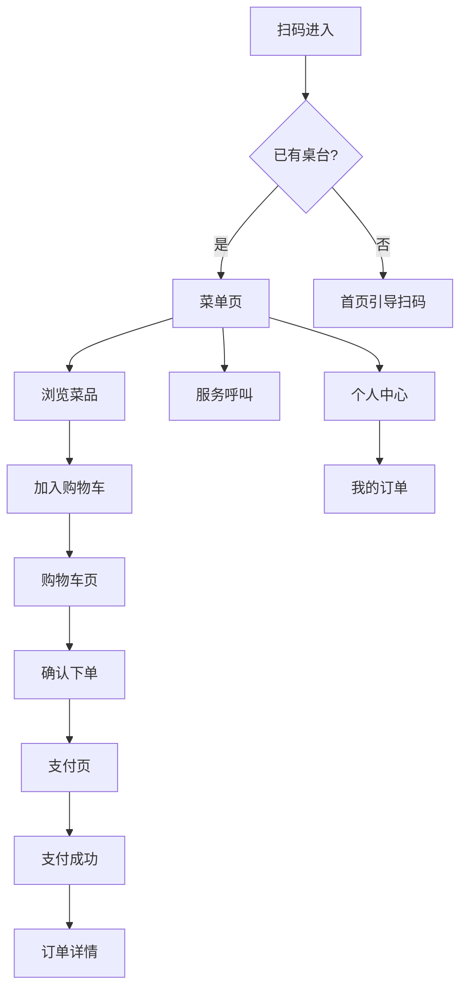
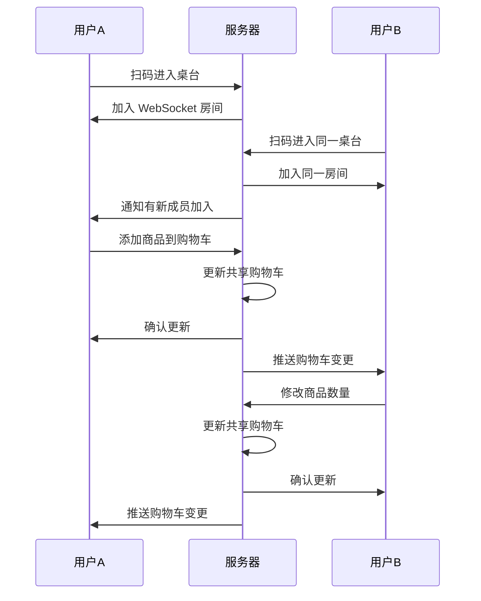

# 桌台扫码点单小程序 - 功能规划文档

## 一、产品概述

### 1.1 产品定位
面向餐饮门店顾客的微信小程序，支持**扫码点单**、**多人协同**、**在线支付**，提供现代化、流畅的点餐体验。

### 1.2 核心特性
- 🍽️ **扫码即用**：无需下载，扫描桌台二维码即可点餐
- 👥 **多人协同**：同桌顾客实时共享购物车，适合聚餐场景
- ⚡ **极速体验**：骨架屏 + 乐观更新，操作响应 < 100ms
- 🎨 **现代 UI**：简约设计，大图展示，沉浸式体验
- 🔔 **实时同步**：WebSocket 实时推送订单状态

### 1.3 技术选型

| 层级 | 技术 | 说明 |
|:---|:---|:---|
| 框架 | uni-app (Vue3 + script setup) | 跨端开发，主攻微信小程序 |
| UI 库 | uni-ui + 自定义组件 | 保证一致的设计语言 |
| 状态管理 | Pinia | Vue3 官方推荐 |
| 请求库 | uni.request 封装 | 统一错误处理 |
| 实时通信 | WebSocket | 协同点单同步 |

---

## 二、页面架构

### 2.1 页面结构

```
pages/
├── index/                    # 首页（扫码入口）
│   └── index.vue
├── scan/                     # 扫码结果页
│   └── index.vue
├── menu/                     # 菜单页（核心）
│   └── index.vue
├── cart/                     # 购物车页
│   └── index.vue
├── order/                    # 下单确认页
│   └── index.vue
├── pay/                      # 支付页
│   └── index.vue
├── order-detail/             # 订单详情
│   └── index.vue
├── order-list/               # 我的订单
│   └── index.vue
├── product-detail/           # 商品详情
│   └── index.vue
├── service/                  # 服务呼叫
│   └── index.vue
└── user/                     # 个人中心
    └── index.vue
```

### 2.2 页面流程



---

## 三、核心功能模块

### 3.1 首页 / 扫码入口

**功能描述**：
- 引导用户扫描桌台二维码
- 展示门店 Logo 和欢迎语
- 支持手动输入桌台号（备用）

**UI 设计要点**：
```
┌─────────────────────────────┐
│                             │
│     [门店 Logo]             │
│                             │
│     欢迎光临 XX 餐厅         │
│                             │
│  ┌─────────────────────┐    │
│  │                     │    │
│  │    [扫码动画]       │    │
│  │                     │    │
│  └─────────────────────┘    │
│                             │
│     [ 扫码点餐 ]            │
│                             │
│     手动输入桌台号 >         │
│                             │
└─────────────────────────────┘
```

### 3.2 菜单页（核心）

**功能描述**：
- 左侧分类导航，右侧商品列表
- 商品卡片大图展示，突出菜品照片
- 加购动画（贝塞尔曲线飞入购物车）
- 底部悬浮购物车栏
- 支持搜索商品
- 分类吸顶效果

**UI 设计要点**：
```
┌─────────────────────────────┐
│ 🔍 搜索菜品              桌号 A01 │
├────┬────────────────────────┤
│    │ ┌──────────────────┐   │
│招牌 │ │    [菜品大图]    │   │
│菜  │ │                  │   │
│    │ └──────────────────┘   │
│----│ 宫保鸡丁           ¥38  │
│    │ 月售 128  👍 95%       │
│凉菜│ [规格选择] [-] 1 [+]   │
│    │                        │
│----│ ┌──────────────────┐   │
│    │ │    [菜品大图]    │   │
│热菜│ │                  │   │
│    │ └──────────────────┘   │
│----│ 麻婆豆腐           ¥28  │
│    │                        │
│饮料│                        │
├────┴────────────────────────┤
│ 🛒 ¥128 (3件)    [ 去结算 ] │
└─────────────────────────────┘
```

**交互细节**：
- 点击分类平滑滚动到对应位置
- 滚动商品列表时分类自动高亮
- 加购时商品图片飞入购物车图标
- 购物车有商品时显示红点数量

### 3.3 商品详情页

**功能描述**：
- 商品大图轮播（支持多图）
- 详细描述和配料信息
- SKU 规格选择（大/中/小）
- 自定义属性选择（辣度、甜度等）
- 备注输入
- 加入购物车

**UI 设计要点**：
```
┌─────────────────────────────┐
│ ┌─────────────────────────┐ │
│ │                         │ │
│ │      [商品轮播图]       │ │
│ │                         │ │
│ └─────────────────────────┘ │
│                             │
│ 宫保鸡丁                    │
│ ¥38                月售 128 │
│                             │
│ 鲜嫩鸡腿肉搭配花生米，       │
│ 经典川菜风味                 │
│                             │
│ ─────────────────────────── │
│ 规格                        │
│ ○ 小份 ¥28  ● 中份 ¥38  ○ 大份 ¥48 │
│                             │
│ ─────────────────────────── │
│ 辣度                        │
│ ○ 不辣  ● 微辣  ○ 中辣  ○ 特辣   │
│                             │
│ ─────────────────────────── │
│ 备注                        │
│ ┌─────────────────────────┐ │
│ │ 不要香菜，少油           │ │
│ └─────────────────────────┘ │
│                             │
├─────────────────────────────┤
│  [-] 1 [+]     [ 加入购物车 ¥38 ] │
└─────────────────────────────┘
```

### 3.4 购物车页

**功能描述**：
- 展示已选商品列表
- 支持修改数量、删除商品
- 显示协同点单成员列表（头像）
- 实时同步其他人的操作
- 清空购物车
- 去结算

**UI 设计要点**：
```
┌─────────────────────────────┐
│ 购物车            桌号 A01  │
├─────────────────────────────┤
│ 👤 张三 👤 李四 正在一起点餐  │
├─────────────────────────────┤
│ ┌───┐                       │
│ │图 │ 宫保鸡丁 (中份/微辣)  │
│ └───┘ ¥38        [-] 2 [+]  │
├─────────────────────────────┤
│ ┌───┐                       │
│ │图 │ 麻婆豆腐 (不辣)       │
│ └───┘ ¥28        [-] 1 [+]  │
├─────────────────────────────┤
│ ┌───┐                       │
│ │图 │ 可乐 (大杯/加冰)      │
│ └───┘ ¥12        [-] 3 [+]  │
├─────────────────────────────┤
│                             │
│ 共 6 件商品                  │
│                             │
│         商品合计  ¥140.00   │
│         优惠      -¥10.00   │
│         ─────────────────── │
│         应付      ¥130.00   │
│                             │
├─────────────────────────────┤
│ 清空购物车   [ 去结算 ¥130 ] │
└─────────────────────────────┘
```

### 3.5 确认下单页

**功能描述**：
- 确认订单信息
- 选择优惠券
- 使用积分抵扣
- 备注信息
- 提交订单

**UI 设计要点**：
```
┌─────────────────────────────┐
│ 确认订单                    │
├─────────────────────────────┤
│ 📍 A01 桌                   │
│                             │
├─────────────────────────────┤
│ 商品清单 (6件)          >   │
│ 宫保鸡丁 x2、麻婆豆腐 x1... │
├─────────────────────────────┤
│ 优惠券                      │
│ 🎫 满100减10         -¥10  >│
├─────────────────────────────┤
│ 积分抵扣                    │
│ 可用 500 积分抵扣 ¥5   [开] │
├─────────────────────────────┤
│ 备注                        │
│ 请尽快上菜，谢谢             │
├─────────────────────────────┤
│                             │
│ 商品合计               ¥140 │
│ 优惠券                 -¥10 │
│ 积分抵扣               -¥5  │
│ ─────────────────────────── │
│ 应付金额              ¥125  │
│                             │
├─────────────────────────────┤
│      [ 提交订单 ¥125 ]      │
└─────────────────────────────┘
```

### 3.6 支付页

**功能描述**：
- 显示支付金额
- 微信支付
- 支付倒计时
- 支付结果

### 3.7 订单详情页

**功能描述**：
- 订单状态追踪（时间轴）
- 商品清单
- 支付信息
- 呼叫服务
- 加菜（追加订单）
- 申请退款

**UI 设计要点**：
```
┌─────────────────────────────┐
│ 订单详情                    │
├─────────────────────────────┤
│      🍳 制作中              │
│   预计 10 分钟后上菜         │
├─────────────────────────────┤
│ 订单进度                    │
│ ● 已下单   14:30            │
│ │                           │
│ ● 已支付   14:31            │
│ │                           │
│ ● 制作中   14:32            │
│ │                           │
│ ○ 已完成                    │
├─────────────────────────────┤
│ 商品清单                    │
│ 宫保鸡丁 (中份)    x2  ¥76  │
│ 麻婆豆腐 (不辣)    x1  ¥28  │
│ 可乐 (大杯)        x3  ¥36  │
├─────────────────────────────┤
│ 订单信息                    │
│ 订单号: 20241203143012001   │
│ 下单时间: 2024-12-03 14:30  │
│ 桌号: A01                   │
├─────────────────────────────┤
│ [ 呼叫服务 ]  [ 加菜 ]      │
└─────────────────────────────┘
```

### 3.8 我的订单

**功能描述**：
- 订单列表（按状态筛选）
- 订单卡片展示
- 快捷操作（再来一单、评价）

### 3.9 服务呼叫

**功能描述**：
- 快捷服务选项（催单、加水、结账、其他）
- 呼叫记录
- 呼叫状态反馈

**UI 设计要点**：
```
┌─────────────────────────────┐
│ 服务呼叫            A01 桌  │
├─────────────────────────────┤
│                             │
│  ┌─────┐  ┌─────┐          │
│  │ 🔔  │  │ 💧  │          │
│  │催单 │  │加水 │          │
│  └─────┘  └─────┘          │
│                             │
│  ┌─────┐  ┌─────┐          │
│  │ 💰  │  │ ❓  │          │
│  │结账 │  │其他 │          │
│  └─────┘  └─────┘          │
│                             │
├─────────────────────────────┤
│ 最近呼叫                    │
│                             │
│ 🔔 催单   14:35   已处理 ✓  │
│ 💧 加水   14:20   已处理 ✓  │
│                             │
└─────────────────────────────┘
```

### 3.10 个人中心

**功能描述**：
- 用户信息展示
- 会员等级与积分
- 我的优惠券
- 我的订单入口
- 设置

---

## 四、核心交互设计

### 4.1 协同点单



### 4.2 乐观更新策略

```javascript
// 添加到购物车
async function addToCart(item) {
  // 1. 立即更新本地 UI
  cartStore.addItem(item);
  playAddAnimation();
  
  // 2. 异步发送请求
  try {
    await api.cart.add(item);
  } catch (error) {
    // 3. 失败回滚
    cartStore.removeItem(item.id);
    showToast('添加失败，请重试');
  }
}
```

### 4.3 骨架屏加载

所有列表页面采用骨架屏，提升感知性能：
- 菜单页：分类 + 商品卡片骨架
- 订单列表：订单卡片骨架
- 商品详情：图片 + 信息骨架

---

## 五、视觉设计规范

### 5.1 设计原则

1. **简约优先**：减少视觉噪音，突出核心信息
2. **大图展示**：菜品照片是核心，给予足够展示空间
3. **触控友好**：按钮最小 44px，间距舒适
4. **品牌一致**：统一的色彩和字体系统

### 5.2 色彩系统

```css
/* 主色 */
--primary: #FF6B35;      /* 活力橙 - 主按钮、强调 */
--primary-light: #FFF0EB; /* 浅橙 - 背景 */

/* 中性色 */
--text-primary: #1A1A1A;   /* 主要文字 */
--text-secondary: #666666;  /* 次要文字 */
--text-placeholder: #999999; /* 占位文字 */
--border: #E5E5E5;          /* 边框 */
--background: #F5F5F5;      /* 页面背景 */
--white: #FFFFFF;           /* 卡片背景 */

/* 语义色 */
--success: #52C41A;  /* 成功 */
--warning: #FAAD14;  /* 警告 */
--error: #FF4D4F;    /* 错误 */
--info: #1890FF;     /* 信息 */
```

### 5.3 字体系统

```css
/* 字号 */
--font-xs: 20rpx;    /* 辅助说明 */
--font-sm: 24rpx;    /* 次要信息 */
--font-md: 28rpx;    /* 正文 */
--font-lg: 32rpx;    /* 标题 */
--font-xl: 36rpx;    /* 大标题 */
--font-xxl: 44rpx;   /* 价格 */

/* 字重 */
--font-normal: 400;
--font-medium: 500;
--font-bold: 600;
```

### 5.4 间距系统

```css
--spacing-xs: 8rpx;
--spacing-sm: 16rpx;
--spacing-md: 24rpx;
--spacing-lg: 32rpx;
--spacing-xl: 48rpx;
```

### 5.5 圆角系统

```css
--radius-sm: 8rpx;   /* 小元素 */
--radius-md: 16rpx;  /* 卡片、按钮 */
--radius-lg: 24rpx;  /* 大卡片 */
--radius-full: 9999px; /* 圆形 */
```

---

## 六、组件设计

### 6.1 通用组件

| 组件 | 说明 |
|:---|:---|
| `QButton` | 按钮（primary/outline/text/icon） |
| `QCard` | 卡片容器 |
| `QBadge` | 徽标 |
| `QTag` | 标签 |
| `QSkeleton` | 骨架屏 |
| `QEmpty` | 空状态 |
| `QPrice` | 价格显示 |
| `QStepper` | 数量步进器 |
| `QAvatar` | 头像 |
| `QDivider` | 分割线 |

### 6.2 业务组件

| 组件 | 说明 |
|:---|:---|
| `ProductCard` | 商品卡片 |
| `CartItem` | 购物车商品项 |
| `OrderCard` | 订单卡片 |
| `CategoryNav` | 分类导航 |
| `CartBar` | 底部购物车栏 |
| `SkuSelector` | 规格选择器 |
| `AttributeSelector` | 属性选择器 |
| `CouponCard` | 优惠券卡片 |
| `OrderTimeline` | 订单时间轴 |

---

## 七、API 对接

### 7.1 接口列表

| 模块 | 接口 | 方法 | 说明 |
|:---|:---|:---|:---|
| 桌台 | `/api/mini/table/info` | GET | 获取桌台信息 |
| 菜单 | `/api/mini/menu` | GET | 获取菜单数据 |
| 商品 | `/api/mini/product/:id` | GET | 商品详情 |
| 购物车 | `/api/mini/cart` | GET | 获取购物车 |
| 购物车 | `/api/mini/cart/add` | POST | 添加到购物车 |
| 购物车 | `/api/mini/cart/update` | PUT | 更新购物车 |
| 购物车 | `/api/mini/cart/remove` | DELETE | 移除商品 |
| 订单 | `/api/mini/order` | POST | 创建订单 |
| 订单 | `/api/mini/order/:id` | GET | 订单详情 |
| 订单 | `/api/mini/orders` | GET | 订单列表 |
| 支付 | `/api/mini/pay` | POST | 发起支付 |
| 服务 | `/api/mini/service/call` | POST | 呼叫服务 |
| 用户 | `/api/mini/user/login` | POST | 微信登录 |
| 优惠券 | `/api/mini/coupons` | GET | 可用优惠券 |

### 7.2 WebSocket 事件

| 事件 | 方向 | 说明 |
|:---|:---|:---|
| `cart:updated` | 服务端→客户端 | 购物车变更 |
| `cart:member_join` | 服务端→客户端 | 新成员加入 |
| `cart:member_leave` | 服务端→客户端 | 成员离开 |
| `order:status_change` | 服务端→客户端 | 订单状态变更 |
| `service:handled` | 服务端→客户端 | 服务呼叫已处理 |

---

## 八、性能优化

### 8.1 首屏优化
- 分包加载：核心页面主包，其他分包
- 菜单数据预加载
- 图片懒加载 + WebP 格式
- 骨架屏提升感知速度

### 8.2 运行时优化
- 虚拟列表（长列表场景）
- 防抖节流（搜索、滚动）
- 本地缓存（菜单数据）
- 乐观更新（购物车操作）

### 8.3 包体积优化
- 按需引入组件
- 图片压缩
- 移除未使用代码

---

## 九、开发计划

### 9.1 第一阶段：核心流程（2周）
- [ ] 项目初始化与基础组件
- [ ] 扫码入口页
- [ ] 菜单列表页
- [ ] 商品详情页
- [ ] 购物车页
- [ ] 下单确认页

### 9.2 第二阶段：支付与订单（1周）
- [ ] 微信支付对接
- [ ] 订单详情页
- [ ] 订单列表页
- [ ] 订单状态追踪

### 9.3 第三阶段：协同与服务（1周）
- [ ] WebSocket 协同点单
- [ ] 服务呼叫功能
- [ ] 加菜功能

### 9.4 第四阶段：会员与优惠（1周）
- [ ] 个人中心
- [ ] 优惠券使用
- [ ] 积分抵扣
- [ ] 会员信息

### 9.5 第五阶段：优化与上线（1周）
- [ ] 性能优化
- [ ] 埋点统计
- [ ] 测试与修复
- [ ] 提交审核

---

## 十、附录

### 10.1 设计参考
- 美团外卖小程序
- 瑞幸咖啡小程序
- 喜茶 GO 小程序

### 10.2 技术文档
- [uni-app 官方文档](https://uniapp.dcloud.io/)
- [微信小程序开发文档](https://developers.weixin.qq.com/miniprogram/dev/framework/)
- [Vue3 Composition API](https://vuejs.org/guide/extras/composition-api-faq.html)
